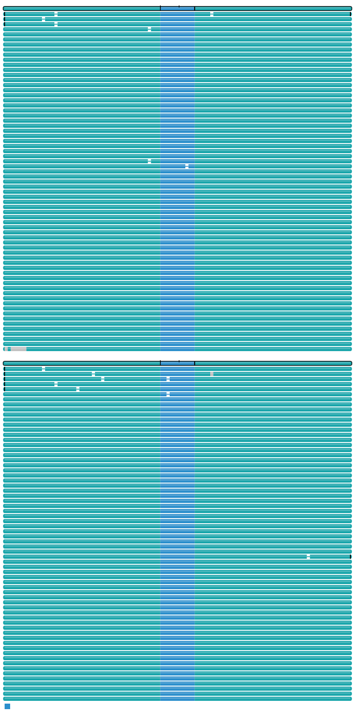

# nf-core/pacvar: Output

## Introduction

This document describes the output produced by the pipeline. Most of the plots are taken from the MultiQC report, which summarises results at the end of the pipeline.

The directories listed below will be created in the results directory after the pipeline has finished. All paths are relative to the top-level results directory.

## Pipeline overview

The pipeline is built using [Nextflow](https://www.nextflow.io/) and processes data using the following steps:

- Demultiplex and alignment
  - [lima](#lima) - Demultiplex samples
  - [pbmerge](#pbmerge) - Merge input BAM with failed BAM if specified in the sample sheet
  - [pbmm2](#pbmm2) - Align samples to reference genome
  - [SAMTools sort](#samtools) - Sort BAM files
  - [SAMTools index](#samtools) - Index BAM files
- WGS workflow
  - [DeepVariant](#deepvariant-rundeepvariant) - Variant call SNVs and small indels
  - [GATK4 Haplotypecaller](#gatk4-haplotypecaller) - Variant call SNVs and small indels
  - [pbsv](#pbsv) - Variant call SVs
  - [tabix](#tabix) - VCF zipping
  - [bcftools index](#bcftools-index) - Index VCF files
  - [Sawfish](#sawfish) - Variant call SVs and CNVs
  - [HiPHASE](#hiphase) - Phase VCF and BAM files
  - [SAMTools index](#samtools) - Index BAM file
  - [HiFiCNV](#hificnv) - Variant call CNVs
  - [pb-CpG-Tools](#pb-cpg-tools-alignedbamtocpgscores) - per-CpG methylation scores and pileup
  - [fibertools-rs](#fibertools-rs-m6a-prediction-and-add-nucleosomes) - Predict m6A or add nucleosome annotations to Fiber-seq BAM files
  - [Ensembl VEP](#ensembl-vep) - Ensembl Variant Effect Predictor used for SNVs, SVs, and CNVs annotation
- Repeat workflow
  - [TRGT](#trgt) - Genotype and plot tandem repeats
  - [SAMTools sort](#samtools) - Sort BAM files
  - [SAMTools index](#samtools) - Index BAM files
  - [bcftools index](#bcftools) - Index VCF files
- [MultiQC](#multiqc)
- [Pipeline information](#pipeline-information) - Report metrics generated during the workflow execution

When `--skip_demultiplexing` is false (default behavior)

### lima

Output files

- `lima/`
  - `<sample><barcode-pair>.bam`: The demultiplexed bamfiles
  - `<basename>.bam.pbi`: The Pacbio index of bam files
  - `<sample>.lima.counts`: Counts of the number of reads found for each demultiplexed sample
  - `<sample>.lima.report`: Tab-separated file about each ZMW (Zero-Mode Waveguide), unfiltered
  - `<sample>.lima.summary`: File that shows how many ZMWs (Zero-Mode Waveguide) have been filtered, how ZMWs many are same/different

Note:

- If `--skip_demultiplexing` is true:
  `<basename> = <sample>`
- If `--skip_demultiplexing` is false:
  `<basename> = <sample>.<barcode-pair>`

[lima](https://lima.how) is a PacBio tool for **demultiplexing HiFi sequencing data** by identifying and trimming barcode sequences, producing per-sample BAM files and associated demultiplexing reports.

### pbmm2

Output files

- `pbmm2/`
  - `<basename>.aligned.bam`: Aligned BAM

[pbmm2](https://github.com/PacificBiosciences/pbmm2) aligns PacBio HiFi reads to a reference genome using a minimap2-based algorithm optimized for long reads.

### SAMTools

Output files

- `samtools/`
  - `<basename>.sorted.bam`: The sorted BAM file.
  - `<basename>.sorted.bam.bai`: The indexed BAM file.

[SAMTools](https://github.com/samtools/samtools) Sort and index aligned bams.

### GATK4 HaplotypeCaller

Output files

- `gatk4/`
  - `<basename>.snv.vcf.gz`: VCF of the SNV
  - `<basename>.snv.vcf.gz.tbi`: Associated indexes for the VCF files

[GATK4 HaplotypeCaller](https://github.com/broadinstitute/gatk/tree/master/src/main/java/org/broadinstitute/hellbender/tools/walkers/haplotypecaller) is a variant caller for identifying small variants (SNVs and small indels) from high-throughput sequencing data.

### DeepVariant (rundeepvariant)

Output files

- `deepvariant/`
  - `<basename>.snv.vcf.gz`: Zipped VCF file
  - `<basename>.snv.vcf.gz.tbi`: Associated index to zipped VCF file

[DeepVariant](https://github.com/google/deepvariant) is a deep learning–based variant caller that identifies small variants (SNVs and small indels) from high-throughput sequencing data. In this workflow, we use the rundeepvariant wrapper provided by DeepVariant to perform variant calling in a standardized and reproducible manner.

### pbsv

Output files

- `pbsv/`
  - `<basename>.sv.vcf`: VCF of SV
  - `<basename>.svsig.gz`: File containing signatures of structural variants

[pbsv](https://github.com/PacificBiosciences/pbsv) is a PacBio structural variant caller for long-read sequencing data. **Note**: In recent PacBio HiFi analysis workflows (HiFi WGS WDL pipeline 3.0.0), pbsv has been replaced by Sawfish, which integrates structural variant and copy number variant calling and is now the recommended SV caller for HiFi data.

### Sawfish

#### Sawfish discover

Output files

- `sawfish/<basename>/<basename>_discovery`
  - `sv_candidates.vcf.gz`: Per-sample structural variant candidate calls from haplotype assembly.
  - `sv_candidates.vcf.gz.tbi`: Tabix index for SV candidates VCF.
  - `contig.alignment.bam`: Assembled haplotype contigs aligned to the reference genome.
  - `contig.alignment.bam.csi`: CSI index for the contig alignment BAM.
  - `assembly.regions.bed`: Genomic regions where local assembly was performed.
  - `copynum.bedgraph`: Preliminary copy number estimates in bedGraph format.
  - `copynum.mpack`: Copy number data in MessagePack binary format.
  - `depth.mpack`: Depth coverage data in MessagePack format.
  - `maf.mpack`: Minor allele frequency data in MessagePack format if `skip_snp=false`.
  - `expected.copy.number.bed`: Expected copy number for genomic regions (e.g., sex chromosomes).
  - `max.depth.bed`: Regions with maximum depth thresholds.
  - `genome.gclevels.mpack`: GC content levels across the genome.
  - `sample.gcbias.mpack`: Sample-specific GC bias correction data.
  - `discover.settings.json`: Configuration file with input paths and parameters.
  - `run.data.json`: Runtime data and statistics.
  - `run.stats.json`: Summary statistics from the discover run.
  - `sawfish.log`: Detailed log file from the discover step.
  - `debug.breakpoint_clusters.bed`: Debug output showing breakpoint cluster locations.
  - `debug.cluster.refinement.txt`: Debug output with cluster refinement details.

#### Sawfish joint-call

Output files

- `sawfish/<basename>/<basename>_jointcall`
  - `genotyped.sv.vcf.gz`: Integrated structural variant and copy number variant calls in VCF format.
  - `genotyped.sv.vcf.gz.tbi`: Tabix index for the joint-called VCF.
  - `contig.alignment.bam`: Merged contig alignments from all samples.
  - `contig.alignment.bam.csi`: CSI index for the contig alignment BAM.
  - `run.stats.json`: Summary statistics from the joint-call run.
  - `sawfish.log`: Detailed log file from the joint-call step.

[Sawfish](https://github.com/PacificBiosciences/sawfish) is a joint structural variant (SV) and copy number variant (CNV) caller for mapped HiFi sequencing reads. It uses a two-step workflow: a per-sample **discover** step that identifies SV candidates through local haplotype assembly, followed by a **joint-call** step that merges, genotypes, and integrates SV and CNV calls across one or more samples.

### HiPhase

Output files

- `hiphase/`
  - `<basename>.snv.phased.bam`: Haplotagged BAM - outputted from phasing based on SNV
  - `<basename>.snv.phased.bam.bai`: Haplotagged BAM index
  - `<basename>.sv.phased.bam`: Haplotagged BAM - outputted from phasing based on SV
  - `<basename>.sv.phased.bam.bai`: Haplotagged BAM index
  - `<basename>.snv.phased.vcf`: The phased Variant File (SNV) (Zipped)
  - `<basename>.sv.phased.vcf`: The phased Variant File (SV) (Zipped)
  - `<basename>.snv.stats.csv`: This CSV/TSV file contains information about the the phase blocks that were output by HiPhase (SNV)
  - `<basename>.sv.stats.csv`: This CSV/TSV file contains information about the the phase blocks that were output by HiPhase (SV)

[HiPhase](https://github.com/PacificBiosciences/HiPhase) performs haplotype phasing of small variants and structural variants from PacBio HiFi sequencing data, generating phased VCFs and haplotagged BAM files for downstream haplotype-aware analyses.

### tabix

[tabix](https://github.com/samtools/htslib) VCF file handler - VCF zipping.

Output files

- `pbsv/`
  - `<basename>.sv.vcf.gz`: Zipped PBSV VCF files

[tabix](https://github.com/samtools/htslib) VCF file handler - VCF zipping.

### bcftools index

Output files

- `pbsv/`
  - `<basename>.sv.vcf.gz.csi`: Index of PBSV VCF files

- `hificnv/`
  - `<basename>.cnv.<sample_id>.vcf.gz.csi`: Index of HiFiCNV VCF files

- `bcftools/`
  - `<basename>.vcf.gz.csi`: Index of TRGT GENOTYPE VCF files

[bcftools](https://github.com/samtools/bcftools) manipulates VCF files including Indexes them

### TRGT

[TRGT](https://github.com/PacificBiosciences/trgt) is a PacBio-developed software for genotyping and plot tandem repeats for HiFi long-read sequencing data.

Output files

- `trgt/`
  - `<basename>.bam.vcf.gz`: VCF file for the repeat region
  - `<basename>.bam.spanning.bam`: BAM for the repeat region
  - `<basename>.png`: Waterfall plot of the repeat region

Example png output: sample1_C9ORF72.png

[TRGT](https://github.com/PacificBiosciences/trgt) is a PacBio-developed software for genotyping and plot tandem repeats for HiFi long-read sequencing data.

### pbmerge

Output files

- `pbmerge/`
  - `<basename>.merged.bam`: merged BAM
  - `<basename>.merged.bam.pbi`: PacBio BAM index

[pbmerge](https://github.com/PacificBiosciences/pbmerge) is a PacBio utility used to merge multiple BAM files into a single BAM file while preserving PacBio-specific metadata.

### HiFiCNV

Output files

- `hificnv/`
  - `<basename>.cnv.<id>.vcf.gz`: Copy number variant calls in VCF format with copy number estimates, confidence intervals, and quality scores.
  - `<basename>.cnv.<id>.copynum.bedgraph`: Copy number segmentation results in bedGraph format with copy number values for each genomic region.
  - `<basename>.cnv.<id>.depth.bw`: Read depth coverage in BigWig format for genome browser visualization.

  If `skip_snp=false`, the SNV VCF output is used to derive minor allele frequencies, and HiFiCNV additionally produces:
  - `<basename>.cnv.<id>.maf.bw`: Minor allele frequency (MAF) in BigWig format for assessing allelic imbalance.

[HiFiCNV](https://github.com/PacificBiosciences/HiFiCNV) is a copy number variant (CNV) caller optimized for PacBio HiFi sequencing reads. The tool detects copy number variants using read depth analysis with optimizations specifically designed for the characteristics of HiFi data.

### pb-CpG-tools (aligned_bam_to_cpg_scores)

Output files

- `pgcpgtools/`
  - `<basename>.cpgscores.combined.bed.gz`: Combined methylation scores across both haplotypes in BED format.
  - `<basename>.cpgscores.combined.bed.gz.tbi`: Index of the combined methylation scores across both haplotypes in BED format.
  - `<basename>.cpgscores.combined.bw`: Combined methylation scores in BigWig format for genome browser visualization.

  If `skip_phase=false`, haplotype-specific methylation outputs are also generated:
  - `<basename>.cpgscore.hap1.bed.gz`: Haplotype 1-specific methylation scores (only for haplotagged reads).
  - `<basename>.cpgscore.hap1.bed.gz.tbi`: Index of the haplotype 1-specific methylation scores (only for haplotagged reads).
  - `<basename>.cpgscores.hap2.bed.gz`: Haplotype 2-specific methylation scores (only for haplotagged reads).
  - `<basename>.cpgscores.hap2.bed.gz.tbi`: Index of the haplotype 2-specific methylation scores (only for haplotagged reads).
  - `<basename>.cpgscores.hap1.bw`: Haplotype 1-specific methylation scores in BigWig format.
  - `<basename>.cpgscores.hap2.bw`: Haplotype 2-specific methylation scores in BigWig format.

The `aligned_bam_to_cpg_scores` tool from [pb-CpG-tools](https://github.com/PacificBiosciences/pb-CpG-tools) generates site-level methylation probabilities from mapped HiFi reads with 5mC base modification tags. When reads are haplotagged, it provides haplotype-specific methylation scores.

### fibertools-rs (m6A prediction and add-nucleosomes)

Output files

- `fibertools/`
  - `<basename>.m6A.bam`: BAM file with m6A calls, nucleosome positions, and MSP annotations added by `ft predict-m6a` when `--skip_m6A_predict false`.
  - `<basename>.m6A.bam.bai`: Index for the m6A/nucleosome-annotated BAM file when `--skip_m6A_predict false`.
  - `<basename>.nuc.bam`: BAM file with nucleosome and MSP annotations added by `ft add-nucleosomes` when `--skip_m6A_predict true`.
  - `<basename>.nuc.bam.bai`: Index for the nucleosome-annotated BAM file when `--skip_m6A_predict true`.
  - `<basename>.m6A.bed.gz`: m6A positions extracted from the annotated BAM with `ft extract --m6a`.
  - `<basename>.nuc.bed.gz`: Nucleosome positions extracted from the annotated BAM with `ft extract --nuc`.

[`fibertools-rs`](https://github.com/fiberseq/fibertools-rs) provides tools for Fiber-seq data analysis. In this workflow, Fiber-seq processing runs when `--skip_fiberseq false`; it uses the phased BAM when SNV phasing is available, otherwise it uses the sorted BAM. When `--skip_m6A_predict false`, `ft predict-m6a` predicts m6A and adds nucleosome/MSP annotations. When `--skip_m6A_predict true`, `ft add-nucleosomes` uses existing A+a m6A calls from the input BAM. The m6A and nucleosome positions are then extracted to BED format with `ft extract --m6a` and `ft extract --nuc`.

### ensembl-vep

Output files

- `annotation/vep/{snv,sv,cnv}`
  - `<basename>.vep.vcf.gz`: Compressed VCF file containing the original variants with added VEP annotations in the `CSQ` INFO field.
  - `<basename>.vep.vcf.gz.tbi`: Index file for the annotated VCF.
  - `<basename>.vep.txt`: (Only if `vep_out_format` is 'tab') A tab-delimited file containing annotation results.
  - `<basename>.vep.summary.html`: A summary report for the run, showing consequence distributions, coding effects, and quality metrics.

[Ensembl Variant Effect Predictor (VEP)](https://www.ensembl.org/info/docs/tools/vep/index.html) determines the effects of variants, including SNVs, small indels, SVs, and CNVs, on genes, transcripts, protein sequences, and regulatory regions. In this pipeline, `ensembl-vep` is used to annotate all supported variant types.

VEP runs in **offline mode** using a local cache to improve performance and ensure reference-version consistency. The cache can be staged from the default S3 bucket (`s3://annotation-cache/vep_cache/`), downloaded with the `ENSEMBLVEP_DOWNLOAD` module, or provided by the user as a local directory.

**Key Annotations Provided:**

- **Consequence:** The sequence ontology term for the variant effect (e.g., `stop_gained`, `missense_variant`).
- **Impact:** The predicted functional severity (HIGH, MODERATE, LOW, or MODIFIER).
- **Gene/Transcript/Feature:** The Ensembl stable IDs for affected genomic features.
- **BIOTYPE:** The classification of the transcript or regulatory feature (e.g., protein_coding).
- **SYMBOL:** The standardized gene symbol (e.g., BRCA2).
- **EXON:** The exon number affected by the variant.
- **SIFT/PolyPhen:** Computational predictions of whether an amino acid substitution affects protein structure or function (reported as both a qualitative rating and a numerical score).
- **Protein_position:** The relative position of the affected amino acid within the protein sequence.
- **CLIN_SIG:** ClinVar Significance based on NCBI ClinVar (e.g., `pathogenic`, `benign`, `uncertain_significance`).
- **HGVSc/HGVSp:** Standardized nomenclature for the variant at the coding and protein levels.

### MultiQC

Output files

- `multiqc/`
  - `multiqc_report.html`: a standalone HTML file that can be viewed in your web browser.
  - `multiqc_data/`: directory containing parsed statistics from the different tools used in the pipeline.

[MultiQC](http://multiqc.info) is a visualization tool that generates a single HTML report summarising all samples in your project. Most of the pipeline QC results are visualised in the report and further statistics are available in the report data directory.

Results generated by MultiQC collate pipeline QC from supported tools e.g. FastQC. The pipeline has special steps which also allow the software versions to be reported in the MultiQC output for future traceability. For more information about how to use MultiQC reports, see <http://multiqc.info>.

### Pipeline information

Output files

- `pipeline_info/`
  - Reports generated by Nextflow: `execution_report.html`, `execution_timeline.html`, `execution_trace.txt` and `pipeline_dag.dot`/`pipeline_dag.svg`.
  - Reports generated by the pipeline: `pipeline_report.html`, `pipeline_report.txt` and `software_versions.yml`. The `pipeline_report*` files will only be present if the `--email` / `--email_on_fail` parameter's are used when running the pipeline.
  - Reformatted samplesheet files used as input to the pipeline: `samplesheet.valid.csv`.
  - Parameters used by the pipeline run: `params.json`.

[Nextflow](https://www.nextflow.io/docs/latest/tracing.html) provides excellent functionality for generating various reports relevant to the running and execution of the pipeline. This will allow you to troubleshoot errors with the running of the pipeline, and also provide you with other information such as launch commands, run times and resource usage.
